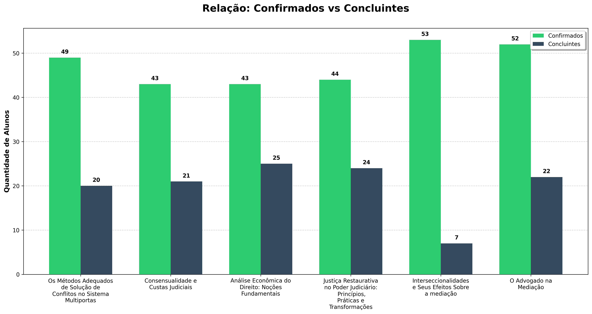
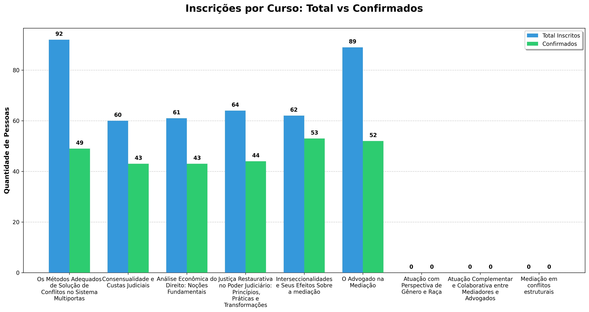
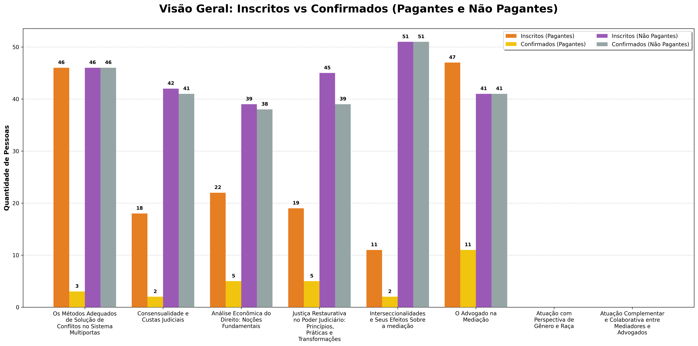
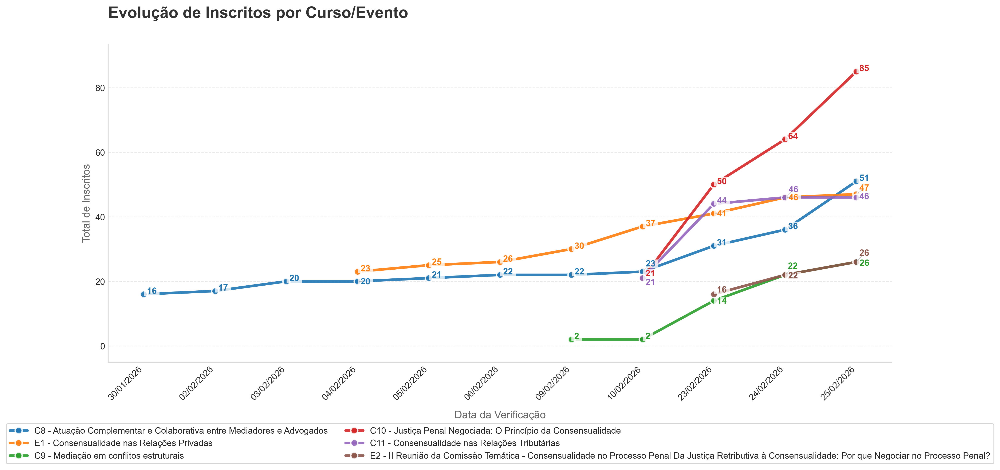

# 📊 Galeria de Resultados (Outputs)

Este diretório contém as visualizações geradas automaticamente pelos scripts de análise. Abaixo estão os gráficos extraídos da planilha `planilha_geral_cursos.xlsx`.

---

### 1. Confirmados vs. Concluintes
Comparativo entre o volume de alunos que confirmaram participação e os que finalizaram o curso.

---

### 2. Status de Inscrições e Cancelamentos
Visualização da taxa de conversão de inscrições e desistências.

---

### 3. Perfil de Pagamento
Distribuição entre alunos pagantes e não pagantes.

---

### 4. Relatório Geral de Inscritos
Visão consolidada do volume total de inscritos processados.

---
_Nota: Estes gráficos são atualizados automaticamente após a execução dos scripts na pasta `/scripts`._